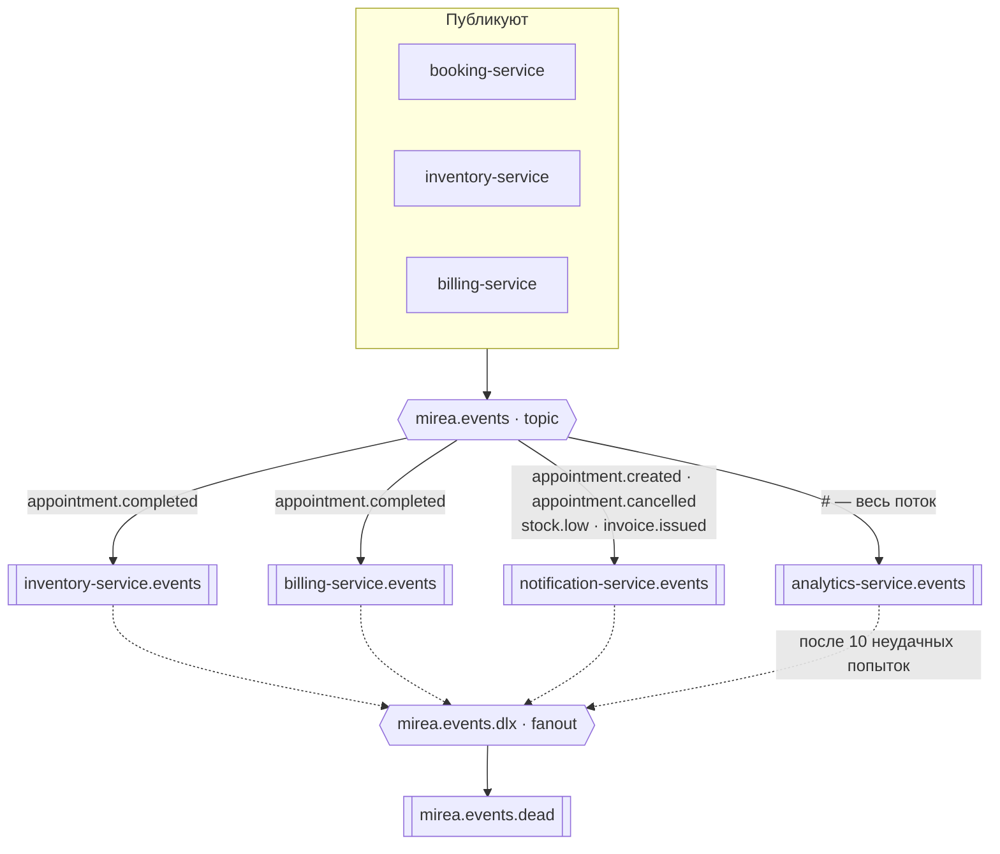
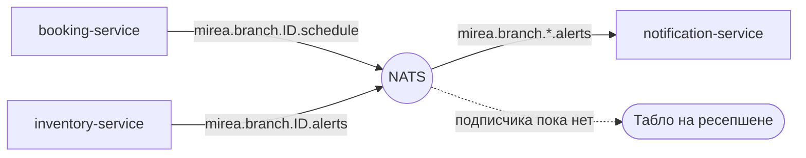
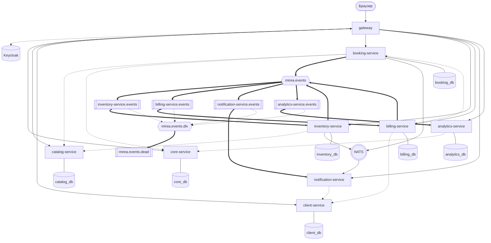

# Mirea CRM

CRM для салонов красоты: записи к специалистам, каталог услуг, складской учёт
расходников, филиальная структура. Девять микросервисов на Python и Go,
четыре транспорта, пятнадцать репозиториев.

Учебный проект по курсу «Микросервисная архитектура» (МИРЭА). Система
поднимается одной командой и работает целиком.

---

## Архитектура

Наружу открыт один порт. Сервисы за шлюзом публичных портов не имеют.
Шлюз проверяет токен Keycloak, извлекает роли и маршрутизирует запрос;
предметной логики в нём нет: иначе он оказался бы связан с каждым сервисом
сразу.

### Синхронный контур: gRPC

Внутренние вызовы идут по gRPC. Граф вызовов ацикличен: ни один сервис
не вызывает того, кто вызывает его, поэтому взаимная блокировка невозможна
по построению.


### Асинхронный контур: RabbitMQ

Изменения состояния, потеря которых недопустима, расходятся доменными
событиями через topic-обменник RabbitMQ. События содержат идентификаторы,
а не снимки данных: детали потребитель дозапрашивает по gRPC.



Каждую очередь читает одноимённый с ней сервис. Очереди quorum-типа
с ограничением в десять доставок: сообщение, которое не удалось обработать,
не повторяется бесконечно, а уходит через fanout-обменник в очередь разбора.

Событие `appointment.completed` обрабатывают три потребителя: списание
расходников, выставление счёта и аналитика. Уведомления подписаны на другие
ключи — создание и отмена записи, выставленный счёт, низкий остаток.

### Живые обновления: NATS

По NATS идут широковещательные обновления, которые устаревают за секунды.
Используется core pub/sub без JetStream: очередей и гарантий доставки нет,
подписчик ресинхронизируется самостоятельно.



| Тема | Публикует | Слушает |
|---|---|---|
| `mirea.branch.{id}.schedule` | booking-service | никто: тема предназначена живому табло, веб-клиента у системы нет |
| `mirea.branch.{id}.alerts` | inventory-service | notification-service, по шаблону `mirea.branch.*.alerts` |

**Разделение брокеров.** RabbitMQ отвечает за сообщения, потеря которых
недопустима: списание материалов, выставленный счёт. Для них нужны
durable-очереди и подтверждения. NATS отвечает за широковещательную рассылку
без гарантий. Это разные классы доставки; объединение их в одной шине
означало бы либо избыточную надёжность там, где она не требуется, либо
её нехватку там, где требуется.

Проекту такого масштаба хватило бы и одного брокера. Второй введён, чтобы
развести оба класса задач явно, и снимается без изменений доменной логики.

---

## Сводная схема



Сплошная стрелка — REST, пунктир — gRPC и отбраковка сообщений, жирная —
события RabbitMQ, линия без стрелки — собственная база. У `gateway`
и `notification-service` базы нет: первый не хранит состояние, второй держит
его в очередях.

---

## Репозитории

### Сервисы

| Репозиторий | Язык | База | Ответственность |
|---|:---:|---|---|
| [`gateway`](https://github.com/mireacrm/gateway) | Python | — | Проверка JWT, роли, маршрутизация |
| [`core-service`](https://github.com/mireacrm/core-service) | Python | `core_db` | Компании, филиалы, сотрудники, графики |
| [`client-service`](https://github.com/mireacrm/client-service) | Python | `client_db` | Клиентская база, контакты, лояльность |
| [`booking-service`](https://github.com/mireacrm/booking-service) | Go | `booking_db` | Записи, расписание специалистов, слоты |
| [`catalog-service`](https://github.com/mireacrm/catalog-service) | Python | `catalog_db` | Услуги, прайс, нормативы расхода |
| [`inventory-service`](https://github.com/mireacrm/inventory-service) | Go | `inventory_db` | Склад расходников, списание, остатки |
| [`billing-service`](https://github.com/mireacrm/billing-service) | Python | `billing_db` | Счета, оплаты, комиссия специалиста |
| [`notification-service`](https://github.com/mireacrm/notification-service) | Go | — | Напоминания клиентам и администраторам |
| [`analytics-service`](https://github.com/mireacrm/analytics-service) | Python | `analytics_db` | Выручка, загрузка, расход материалов |

Go используется там, где существенна конкурентность: захват слотов, счётчики
остатков, рассыльщик, работающий с двумя брокерами. Python — там, где важнее
скорость разработки и работа с данными.

### Общее хозяйство

| Репозиторий | Что внутри |
|---|---|
| [`deploy`](https://github.com/mireacrm/deploy) | **Точка входа.** Compose, настройки инфраструктуры, описание архитектуры |
| [`proto`](https://github.com/mireacrm/proto) | Контракты gRPC и событий — источник правды |
| [`contracts-go`](https://github.com/mireacrm/contracts-go) · [`contracts-py`](https://github.com/mireacrm/contracts-py) | Сгенерированный код. Правится только перегенерацией |
| [`go-common`](https://github.com/mireacrm/go-common) · [`py-common`](https://github.com/mireacrm/py-common) | Общий обвяз: транспорт, трассировка, метрики, каркас процесса |

---

## Запуск

```bash
git clone https://github.com/mireacrm/deploy.git && cd deploy
cp .env.example .env
docker compose up -d
```

Образы берутся готовыми из `ghcr.io/mireacrm/*`: каждый сервис собирается
и публикуется в своём репозитории. Вход в систему — `http://localhost:8000`.

---

## Контракты прежде реализации

Файлы `.proto` — единственный источник правды. Тег на
[`proto`](https://github.com/mireacrm/proto) перегенерирует код и раскладывает
его по языковым репозиториям под той же версией, поэтому описание и стабы
разойтись не могут:

```
proto v0.2.0  ─┬─→  contracts-go v0.2.0  ─→  go-common  ─→  сервисы на Go
               └─→  contracts-py v0.2.0  ─→  py-common  ─→  сервисы на Python
```

Версию поднимает потребитель. Это цена разъезда по репозиториям:
несовместимая правка контракта обнаруживается не в одном общем прогоне,
а в каждом сервисе в момент повышения версии.

---

## Устройство сервиса

Одинаково независимо от языка: REST наружу, gRPC внутрь, собственная база,
миграции при старте, раздельные `/healthz` и `/readyz`, метрики Prometheus,
сквозная трассировка, модульные и интеграционные тесты в конвейере.

Интеграционные тесты выполняются против Postgres, RabbitMQ, NATS и Keycloak,
поднятых в прогоне, а не против заглушек.
