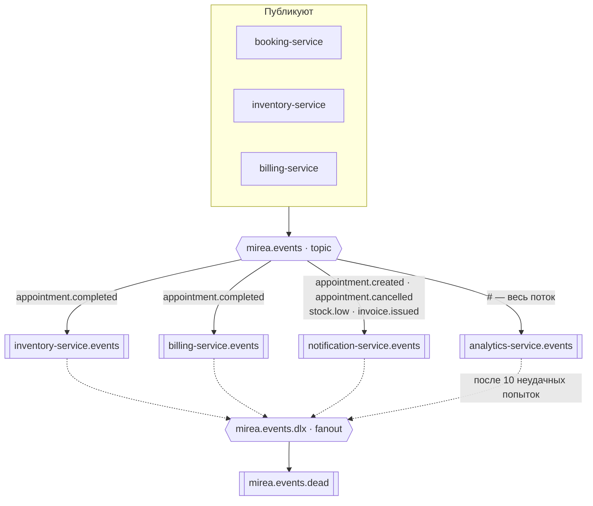

# Mirea CRM

CRM для салонов красоты: записи к специалистам, услуги, расходники, филиалы.
Девять микросервисов на Python и Go, четыре транспорта, пятнадцать репозиториев.

Учебный проект по курсу «Микросервисная архитектура» (МИРЭА), доведённый
до состояния, в котором система поднимается одной командой и работает целиком.

---

## Как это устроено

Наружу открыт **один порт**. Сервисы за шлюзом публичных портов не имеют:
он проверяет токен Keycloak, достаёт роли и маршрутизирует. Предметной
логики в нём нет намеренно — иначе получился бы распределённый монолит.

### Синхронный контур

Внутренние вызовы идут по gRPC. Граф ацикличен: ни один сервис не вызывает
того, кто вызывает его — поэтому взаимной блокировки не бывает по построению.


### Асинхронный контур

Всё, что меняет состояние и что нельзя потерять, расходится событиями через
topic-обменник. События тонкие: несут идентификаторы, а не снимки — детали
потребитель дозапрашивает сам.



Очередь читает сервис одноимённый с ней. Все они quorum-типа с ограничением
в десять доставок: сообщение, которое не удалось обработать, не крутится
вечно, а уходит через fanout-обменник в очередь разбора.

Завершение визита расходится на **троих**: списание расходников, выставление
счёта и аналитику. Уведомления живут на других ключах — их интересует
создание и отмена записи, выставленный счёт и низкий остаток.

### Живые обновления

Второй брокер, NATS, несёт широковещательные обновления, где сообщение
устаревает за секунды: очередей нет, гарантий доставки нет, подписчик
ресинхронизируется сам. Core pub/sub, без JetStream.


| Тема | Публикует | Слушает |
|---|---|---|
| `mirea.branch.{id}.schedule` | booking-service | никто: предназначена живому табло, а веб-клиента у системы нет |
| `mirea.branch.{id}.alerts` | inventory-service | notification-service, по шаблону `mirea.branch.*.alerts` |

**Почему два брокера.** RabbitMQ несёт то, что меняет состояние и что нельзя
потерять: списание материалов, выставленный счёт. Нужны durable-очереди
и подтверждения. NATS — broadcast без гарантий. Это разные классы доставки,
и смешивать их в одной шине значит либо переплачивать за надёжность там,
где она не нужна, либо терять её там, где нужна.

Оговорка по существу: проекту такого масштаба хватило бы одного брокера.
Второй взят, чтобы развести оба класса задач явно, и снимается без правок
доменной логики.

---

## Репозитории

### Сервисы

| Репозиторий | Язык | База | Ответственность |
|---|:---:|---|---|
| [`gateway`](https://github.com/mireacrm/gateway) | Python | — | Проверка JWT, роли, маршрутизация |
| [`core-service`](https://github.com/mireacrm/core-service) | Python | `core_db` | Компании, филиалы, сотрудники, графики |
| [`client-service`](https://github.com/mireacrm/client-service) | Python | `client_db` | Клиентская база, контакты, лояльность |
| [`booking-service`](https://github.com/mireacrm/booking-service) | Go | `booking_db` | Записи, расписание специалистов, слоты |
| [`catalog-service`](https://github.com/mireacrm/catalog-service) | Python | `catalog_db` | Услуги, прайс, нормативы расхода |
| [`inventory-service`](https://github.com/mireacrm/inventory-service) | Go | `inventory_db` | Склад расходников, списание, остатки |
| [`billing-service`](https://github.com/mireacrm/billing-service) | Python | `billing_db` | Счета, оплаты, комиссия специалиста |
| [`notification-service`](https://github.com/mireacrm/notification-service) | Go | — | Напоминания клиентам и администраторам |
| [`analytics-service`](https://github.com/mireacrm/analytics-service) | Python | `analytics_db` | Выручка, загрузка, расход материалов |

Go взят там, где уместен по существу: конкурентный захват слотов, счётчики
остатков, лёгкий рассыльщик на двух брокерах. Python — там, где ценнее
скорость разработки и работа с данными.

### Общее хозяйство

| Репозиторий | Что внутри |
|---|---|
| [`deploy`](https://github.com/mireacrm/deploy) | **Точка входа.** Compose, настройки инфраструктуры, описание архитектуры |
| [`proto`](https://github.com/mireacrm/proto) | Контракты gRPC и событий — источник правды |
| [`contracts-go`](https://github.com/mireacrm/contracts-go) · [`contracts-py`](https://github.com/mireacrm/contracts-py) | Сгенерированный код. Руками не правятся |
| [`go-common`](https://github.com/mireacrm/go-common) · [`py-common`](https://github.com/mireacrm/py-common) | Общий обвяз: транспорт, трассировка, метрики, каркас процесса |

---

## Запуск

```bash
git clone https://github.com/mireacrm/deploy.git && cd deploy
cp .env.example .env
docker compose up -d
```

Образы берутся готовыми из `ghcr.io/mireacrm/*` — каждый сервис собирается
у себя и приезжает опубликованным. Вход в систему: `http://localhost:8000`.

---

## Контракты прежде реализации

`.proto` — единственный источник правды. Тег на [`proto`](https://github.com/mireacrm/proto)
перегенерирует код и раскладывает его по языковым репозиториям под той же
версией, так что описание и стабы разойтись не могут:

```
proto v0.2.0  ─┬─→  contracts-go v0.2.0  ─→  go-common  ─→  сервисы на Go
               └─→  contracts-py v0.2.0  ─→  py-common  ─→  сервисы на Python
```

Версию поднимает потребитель, осознанно. Это цена разъезда по репозиториям:
несовместимая правка контракта обнаружится не в одном общем прогоне, а у
каждого сервиса в момент повышения версии.

---

## Что внутри каждого сервиса

Единообразно, независимо от языка: REST наружу, gRPC внутрь, собственная база,
миграции при старте, `/healthz` и `/readyz` по отдельности, метрики Prometheus,
сквозная трассировка, модульные и интеграционные тесты в конвейере.

Интеграционные — против настоящих Postgres, RabbitMQ, NATS и Keycloak,
поднятых в прогоне. Не заглушек.
