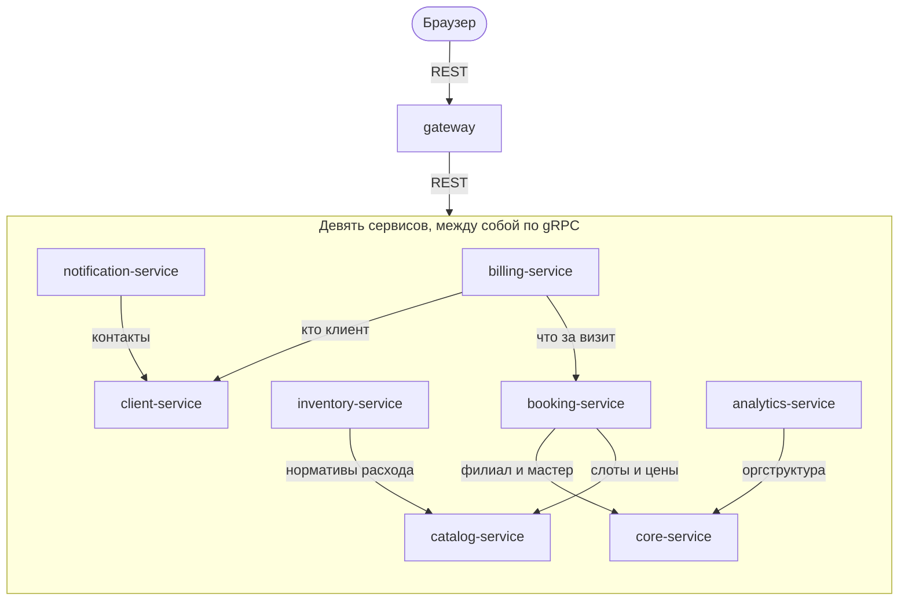
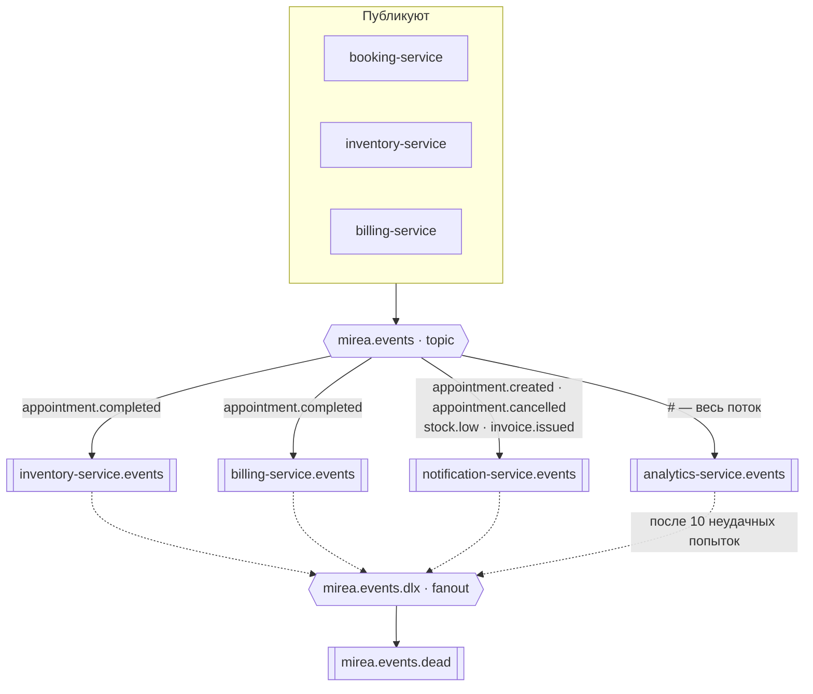
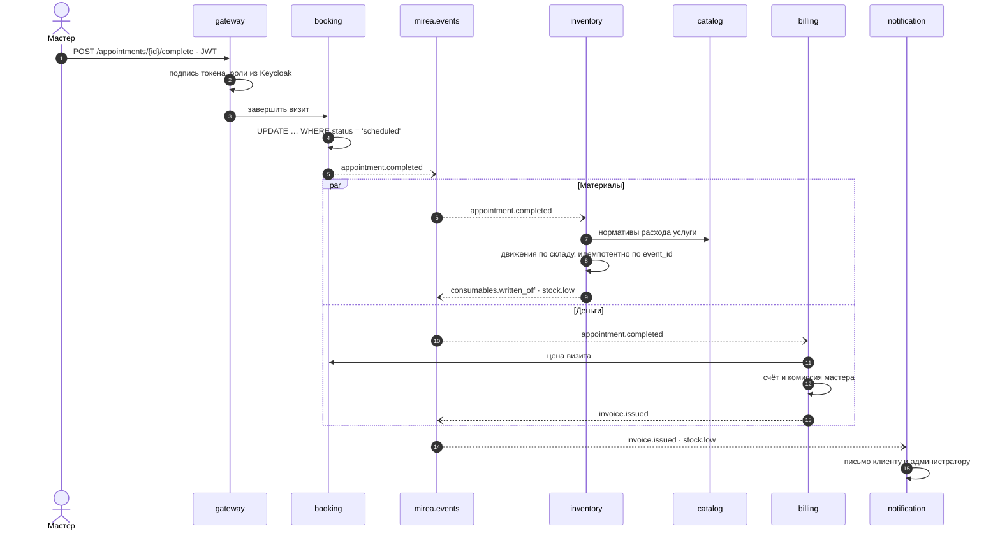

<div align="center">


<p>


</p>

<p>


</p>

<p>


</p>

<p>
<a href="#архитектура">Архитектура</a> ·
<a href="#сценарий-завершение-визита">Сценарий</a> ·
<a href="#поведение-под-сбоем">Сбои</a> ·
<a href="#сводная-схема">Сводная схема</a> ·
<a href="#репозитории">Репозитории</a> ·
<a href="#запуск">Запуск</a> ·
<a href="#контракты-прежде-реализации">Контракты</a>
</p>

</div>

---

Практические работы по курсу «Микросервисная архитектура» (МИРЭА),
доведённые до состояния системы: девять сервисов на Python и Go, четыре
транспорта, пятнадцать репозиториев, всё поднимается одной командой.

Значки состояния выше не нарисованы: конвейеры, число тестов и доли языков
пересчитывает работа [`badges.yml`](https://github.com/mireacrm/.github/actions/workflows/badges.yml)
по расписанию и кладёт в репозиторий профиля.

## Архитектура

Наружу открыт один порт. Сервисы за шлюзом публичных портов не имеют.
Шлюз проверяет токен Keycloak, извлекает роли и маршрутизирует запрос;
предметной логики в нём нет: иначе он оказался бы связан с каждым сервисом
сразу.

### Синхронный контур: gRPC

Внутренние вызовы идут по gRPC. Граф вызовов ацикличен: ни один сервис
не вызывает того, кто вызывает его, поэтому взаимная блокировка невозможна
по построению.



### Асинхронный контур: RabbitMQ

Изменения состояния, потеря которых недопустима, расходятся доменными
событиями через topic-обменник RabbitMQ. События содержат идентификаторы,
а не снимки данных: детали потребитель дозапрашивает по gRPC.



Каждую очередь читает одноимённый с ней сервис. Очереди quorum-типа
с ограничением в десять доставок: сообщение, которое не удалось обработать,
не повторяется бесконечно, а уходит через fanout-обменник в очередь разбора.

<details>
<summary><b>Каталог доменных событий</b> — восемь ключей маршрутизации</summary>

<br>

| Ключ | Публикует | Потребители |
|---|---|---|
| `appointment.created` | `booking-service` | `notification-service` · `analytics-service` |
| `appointment.completed` | `booking-service` | `inventory-service` · `billing-service` · `analytics-service` |
| `appointment.cancelled` | `booking-service` | `notification-service` · `analytics-service` |
| `consumables.written_off` | `inventory-service` | `analytics-service` |
| `stock.low` | `inventory-service` | `notification-service` · `analytics-service` |
| `invoice.issued` | `billing-service` | `notification-service` · `analytics-service` |
| `invoice.paid` | `billing-service` | `analytics-service` |
| `client.registered` | `client-service` | `analytics-service` |

Очередь аналитики связана с обменником по `#` и получает весь поток: отчёты
считаются по событиям, а не опросом чужих баз. Каждое событие описано
сообщением в [`proto`](https://github.com/mireacrm/proto) и приходит
потребителю как разобранный конверт, а не как свободный JSON.

</details>

### Живые обновления: NATS

По NATS идут широковещательные обновления, которые устаревают за секунды.
Используется core pub/sub без JetStream: очередей и гарантий доставки нет,
подписчик ресинхронизируется самостоятельно.


| Тема | Публикует | Слушает |
|---|---|---|
| `mirea.branch.{id}.schedule` | booking-service | никто: тема предназначена живому табло, веб-клиента у системы нет |
| `mirea.branch.{id}.alerts` | inventory-service | notification-service, по шаблону `mirea.branch.*.alerts` |

**Разделение брокеров.** RabbitMQ отвечает за сообщения, потеря которых
недопустима: списание материалов, выставленный счёт. Для них нужны
durable-очереди и подтверждения. NATS отвечает за широковещательную рассылку
без гарантий. Это разные классы доставки; объединение их в одной шине
означало бы либо избыточную надёжность там, где она не требуется, либо
её нехватку там, где требуется.

Проекту такого масштаба хватило бы и одного брокера. Второй введён, чтобы
развести оба класса задач явно, и снимается без изменений доменной логики.

## Сценарий: завершение визита

Один запрос мастера задевает пять сервисов, два транспорта и три базы.
Ни одного распределённого транзакционного менеджера при этом нет.



Событие несёт только идентификаторы, поэтому `billing` спрашивает цену
у `booking`, а `inventory` — нормативы у `catalog`. Снимок данных в событии
избавил бы от двух вызовов, но означал бы, что цена визита существует
в системе в двух местах сразу.

## Поведение под сбоем

Потребитель может упасть, событие может прийти дважды, два запроса могут
прийти одновременно. Разбирается это в базе и в обвязе, а не в доменном коде
каждого сервиса.

| Что случилось | Что делает система |
|---|---|
| Обработчик упал на событии | Сообщение возвращается в очередь, пауза — `0,5 с × номер попытки`, но не больше пяти секунд |
| Десять неудач подряд | Сообщение уходит через fanout-обменник в `mirea.events.dead` и ждёт разбора руками |
| Событие доставлено дважды | `event_id` вставляется в `processed_events` в одной транзакции с эффектом; повтор получает конфликт и завершается без действия |
| Две записи на один слот | Ограничение `EXCLUDE USING gist` по мастеру и диапазону времени: гонку разрешает Postgres, а не проверка в коде |
| Две одновременные оплаты счёта | Условный `UPDATE … WHERE status = 'issued'`: побеждает один запрос, второй получает конфликт, а не молчаливый успех |
| Брокер недоступен при публикации | Сбой публикации логируется и не откатывает уже принятое доменное решение — визит остаётся завершённым |

## Сводная схема


Сплошная стрелка — REST, пунктир — gRPC и отбраковка сообщений, жирная —
события RabbitMQ, линия без стрелки — собственная база. У `gateway`
и `notification-service` базы нет: первый не хранит состояние, второй держит
его в очередях.

## Репозитории

### Сервисы

| Сервис | Стек | База | Ответственность | Конвейер |
|---|:---:|---|---|:---:|
| **[`gateway`](https://github.com/mireacrm/gateway)** |  | — | Проверка JWT, роли, маршрутизация | [](https://github.com/mireacrm/gateway/actions/workflows/ci.yml) |
| **[`core-service`](https://github.com/mireacrm/core-service)** |  | `core_db` | Компании, филиалы, сотрудники, графики | [](https://github.com/mireacrm/core-service/actions/workflows/ci.yml) |
| **[`client-service`](https://github.com/mireacrm/client-service)** |  | `client_db` | Клиентская база, контакты, лояльность | [](https://github.com/mireacrm/client-service/actions/workflows/ci.yml) |
| **[`booking-service`](https://github.com/mireacrm/booking-service)** |  | `booking_db` | Записи, расписание специалистов, слоты | [](https://github.com/mireacrm/booking-service/actions/workflows/ci.yml) |
| **[`catalog-service`](https://github.com/mireacrm/catalog-service)** |  | `catalog_db` | Услуги, прайс, нормативы расхода | [](https://github.com/mireacrm/catalog-service/actions/workflows/ci.yml) |
| **[`inventory-service`](https://github.com/mireacrm/inventory-service)** |  | `inventory_db` | Склад расходников, списание, остатки | [](https://github.com/mireacrm/inventory-service/actions/workflows/ci.yml) |
| **[`billing-service`](https://github.com/mireacrm/billing-service)** |  | `billing_db` | Счета, оплаты, комиссия специалиста | [](https://github.com/mireacrm/billing-service/actions/workflows/ci.yml) |
| **[`notification-service`](https://github.com/mireacrm/notification-service)** |  | — | Напоминания клиентам и администраторам | [](https://github.com/mireacrm/notification-service/actions/workflows/ci.yml) |
| **[`analytics-service`](https://github.com/mireacrm/analytics-service)** |  | `analytics_db` | Выручка, загрузка, расход материалов | [](https://github.com/mireacrm/analytics-service/actions/workflows/ci.yml) |

Go используется там, где существенна конкурентность: захват слотов, счётчики
остатков, рассыльщик, работающий с двумя брокерами. Python — там, где важнее
скорость разработки и работа с данными.

Каждый сервис собирает свой образ и публикует его
в [`ghcr.io/mireacrm/*`](https://github.com/orgs/mireacrm/packages) —
отдельной сборки при развёртывании не требуется.

### Общее хозяйство

| Репозиторий | Что внутри | Состояние |
|---|---|:---:|
| **[`deploy`](https://github.com/mireacrm/deploy)** | **Точка входа.** Compose, настройки инфраструктуры, описание архитектуры | |
| **[`proto`](https://github.com/mireacrm/proto)** | Контракты gRPC и событий — источник правды | [](https://github.com/mireacrm/proto/tags)<br>[](https://github.com/mireacrm/proto/actions/workflows/release.yml) |
| **[`contracts-go`](https://github.com/mireacrm/contracts-go)** | Сгенерированный код для Go. Правится только перегенерацией | [](https://github.com/mireacrm/contracts-go/tags) |
| **[`contracts-py`](https://github.com/mireacrm/contracts-py)** | Сгенерированный код для Python. Правится только перегенерацией | [](https://github.com/mireacrm/contracts-py/tags) |
| **[`go-common`](https://github.com/mireacrm/go-common)** · **[`py-common`](https://github.com/mireacrm/py-common)** | Общий обвяз: транспорт, трассировка, метрики, каркас процесса | |

## Запуск

```bash
git clone https://github.com/mireacrm/deploy.git && cd deploy
cp .env.example .env
docker compose up -d
```

> [!TIP]
> Образы берутся готовыми из `ghcr.io/mireacrm/*` — собирать ничего не нужно,
> первый запуск упирается только в скорость сети.

Когда стенд поднялся, доступны:

| Адрес | Что это |
|---|---|
| <http://localhost:8000> | **API шлюза** — единственный вход в систему |
| <http://localhost:8080> | Keycloak: пользователи, роли, выдача токенов |
| <http://localhost:15672> | RabbitMQ: обменники, очереди, очередь разбора |
| <http://localhost:8222> | NATS: страница мониторинга |
| <http://localhost:16686> | Jaeger: сквозные трассировки запросов |
| <http://localhost:9090> | Prometheus: метрики сервисов и инфраструктуры |
| <http://localhost:3000> | Grafana: дашборды по сервисам и очередям |

## Контракты прежде реализации

Файлы `.proto` — единственный источник правды. Тег на
[`proto`](https://github.com/mireacrm/proto) перегенерирует код и раскладывает
его по языковым репозиториям под той же версией, поэтому описание и стабы
разойтись не могут:

```
proto v0.1.1  ─┬─→  contracts-go v0.1.1  ─→  go-common  ─→  сервисы на Go
               └─→  contracts-py v0.1.1  ─→  py-common  ─→  сервисы на Python
```

Версию поднимает потребитель. Это цена разъезда по репозиториям:
несовместимая правка контракта обнаруживается не в одном общем прогоне,
а в каждом сервисе в момент повышения версии.

## Устройство сервиса

Одинаково независимо от языка: REST наружу, gRPC внутрь, собственная база,
миграции при старте, раздельные `/healthz` и `/readyz`, метрики Prometheus,
сквозная трассировка, модульные и интеграционные тесты в конвейере.

Интеграционные тесты выполняются против Postgres, RabbitMQ, NATS и Keycloak,
поднятых в прогоне, а не против заглушек.

<div align="center">


</div>
